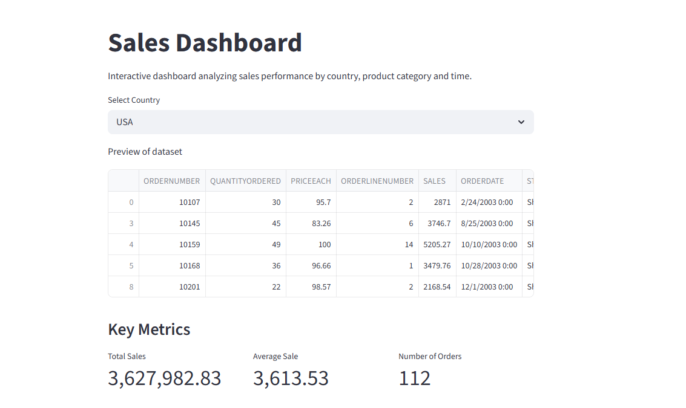
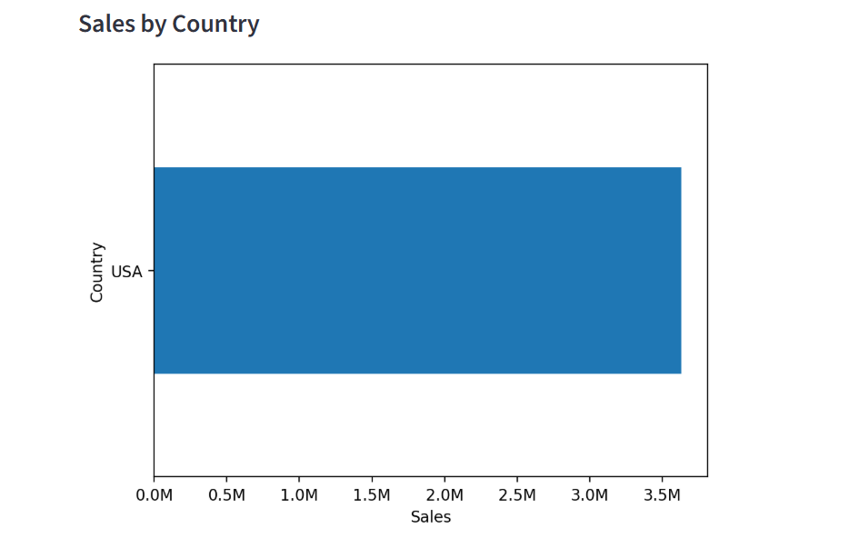
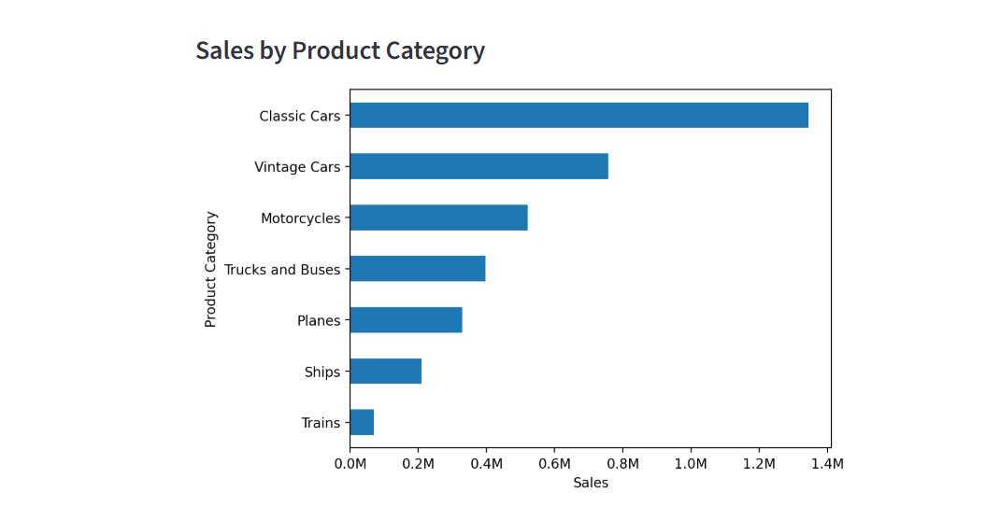
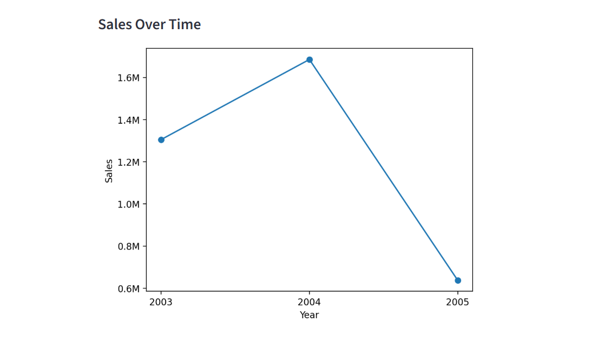

# Sales Dashboard (Python + Streamlit)

Interactive dashboard for analyzing sales performance by country, product category and time.

## Features

- Country filter
- Key sales metrics
- Sales by country
- Sales by product category
- Sales trend over time

## Technologies

- Python
- pandas
- matplotlib
- Streamlit

## Dataset

Sample sales dataset containing orders, products, countries and yearly sales data.

## How to run the project

Install dependencies:

pip install pandas matplotlib streamlit

Run dashboard:

streamlit run dashboard.py

## Dashboard Preview

### Key Metrics

### Sales by Country

### Sales by Product Category

### Sales Over Time

